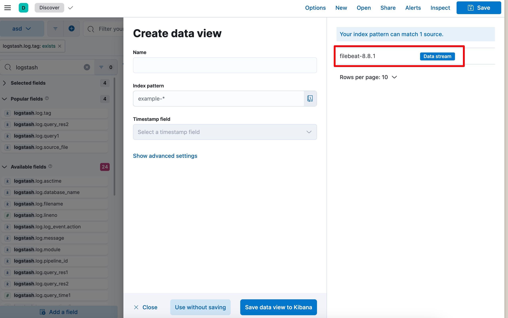
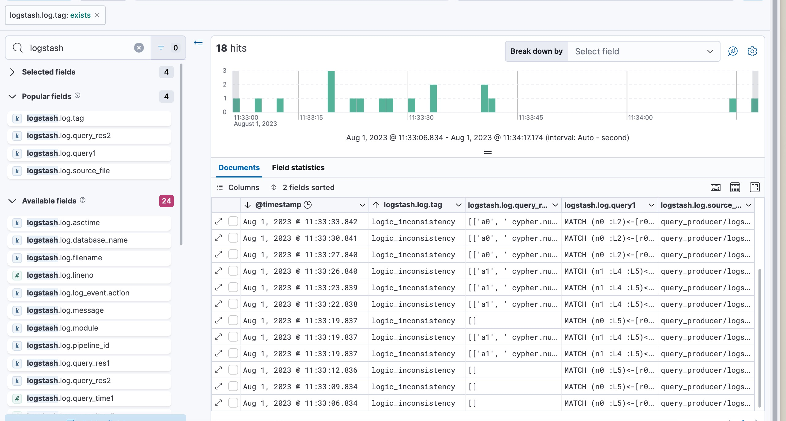

# GRev: Testing Graph Database Systems via Equivalent Query Rewriting

Features:

- Efficient Deployment: Initiate testing through Docker-compose for quick and streamlined server deployment.
- Comprehensive Monitoring: Detailed bug analysis is made possible through integration with Elastic Search and Kibana, ensuring consistent performance tracking.
- Real-Time Notifications: Configurable Lark webhooks provide instant test messages in your Instant Messaging (IM) app, keeping you informed on-the-go.
- Simplified Validation: Simply copy original queries to validate.py in Python to perform straightforward validation.

## Quick Start

### Prepare Queries

You need Java version 11 to run the GDsmith.

```
$ java --version                                                                                        
openjdk 11.0.19 2023-04-18
OpenJDK Runtime Environment (build 11.0.19+7-post-Ubuntu-0ubuntu122.04.1)
OpenJDK 64-Bit Server VM (build 11.0.19+7-post-Ubuntu-0ubuntu122.04.1, mixed mode, sharing)
```

Then run the `GDsmith.jar` in the `query_producer`. The following command will produce 100 files in `query_producer/logs/composite`. You can change the `num-thread` and `num-tries` to speed up the generation.

```bash
$ cd query_producer
$ java -jar GDsmith.jar --num-tries 100 --num-queries 5000 --algorithm compared3 --num-threads 16 composite
```


### Start Testing

Now you need to start the database servers. We have already provided the docker-compose file, since Nebula requires a cluster, you have to start the Nebula cluster first.

```bash
$ cd nebula-docker-compose
$ docker compose up -d
```

Then go back to the project root, you just need to enter `docker compose up -d`, the testing will start.

```bash
$ docker build -t pt .
$ docker compose up -d                                                                       
[+] Running 12/12
 ✔ Container elasticsearch                           Running                                             0.0s 
 ✔ Container pattern-transformer-cypher2gremlin-1    Running                                             0.0s 
 ✔ Container kibana                                  Running                                             0.0s 
 ✔ Container pattern-transformer-nebula_client-1     Running                                             0.0s 
 ✔ Container logstash                                Running                                             0.0s 
 ✔ Container pattern-transformer-tinkerpop_client-1  Started                                             0.8s 
 ✔ Container pattern-transformer-redis-stack-1       Ru...                                               0.0s 
 ✔ Container pattern-transformer-memgraph-1          Runni...                                            0.0s 
 ✔ Container pattern-transformer-redis_client-1      R...                                                0.0s 
 ✔ Container pattern-transformer-memgraph_client-1   Running                                             0.0s 
 ✔ Container pattern-transformer-neo4j-1             Running                                             0.0s 
 ✔ Container pattern-transformer-neo4j_client-1      R...                                                0.0s 
```


### Review Found Bugs

You can monitor the runtime logs in `docker shell`, or watching the `logs` folder.

#### Docker Logs

First you can see what containers we have:

```bash
NAME                                     IMAGE                                                 COMMAND                  SERVICE             CREATED             STATUS              PORTS
elasticsearch                            docker.elastic.co/elasticsearch/elasticsearch:8.8.1   "/bin/tini -- /usr/l…"   elasticsearch       14 hours ago        Up 14 hours         0.0.0.0:9200->9200/tcp, :::9200->9200/tcp, 0.0.0.0:9300->9300/tcp, :::9300->9300/tcp
kibana                                   docker.elastic.co/kibana/kibana:8.8.1                 "/bin/tini -- /usr/l…"   kibana              14 hours ago        Up 14 hours         0.0.0.0:5601->5601/tcp, :::5601->5601/tcp
logstash                                 docker.elastic.co/logstash/logstash:8.8.1             "/usr/local/bin/dock…"   logstash            14 hours ago        Up 14 hours         0.0.0.0:5044-5045->5044-5045/tcp, :::5044-5045->5044-5045/tcp, 9600/tcp
pattern-transformer-cypher2gremlin-1     pattern-transformer-cypher2gremlin                    "java -jar demo-0.0.…"   cypher2gremlin      14 hours ago        Up 14 hours         0.0.0.0:8085->8080/tcp, :::8085->8080/tcp
pattern-transformer-memgraph-1           memgraph/memgraph-platform:latest                     "/bin/sh -c '/usr/bi…"   memgraph            14 hours ago        Up 14 hours         0.0.0.0:3000->3000/tcp, :::3000->3000/tcp, 0.0.0.0:7688->7687/tcp, :::7688->7687/tcp
pattern-transformer-memgraph_client-1    pt                                                    "bash ./scripts/run_…"   memgraph_client     14 hours ago        Up 17 minutes       
pattern-transformer-neo4j-1              neo4j:5.6.0-enterprise                                "tini -g -- /startup…"   neo4j               14 hours ago        Up 14 hours         0.0.0.0:7474->7474/tcp, :::7474->7474/tcp, 7473/tcp, 0.0.0.0:7687->7687/tcp, :::7687->7687/tcp
pattern-transformer-neo4j_client-1       pt                                                    "bash ./scripts/run_…"   neo4j_client        14 hours ago        Up About an hour    
pattern-transformer-redis-stack-1        redis/redis-stack:6.2.6-v7                            "/entrypoint.sh"         redis-stack         14 hours ago        Up 14 hours         0.0.0.0:6379->6379/tcp, :::6379->6379/tcp, 8001/tcp
pattern-transformer-redis_client-1       pt                                                    "bash ./scripts/run_…"   redis_client        14 hours ago        Up 2 hours          
pattern-transformer-tinkerpop_client-1   pt                                                    "bash ./scripts/run_…"   tinkerpop_client    14 hours ago        Up 9 minutes
```

Take neo4j as an example, you can see the logs by the following commands:

```bash
$ docker compose logs -f neo4j_client
```

#### Log Files

You can see the files similar to the following. Each `*.tsv` contains the logic error that we found, each `*.log` contains the full logs of the runtime, and `*.json` contains 10 max performance inconsistency query pairs.
```bash
$ tree logs
logs
├── memgraph.log
├── memgraph_performance.json
├── nebula.log
├── nebula_logic_error.tsv
├── nebula_performance.json
├── neo4j.log
├── neo4j_performance.json
├── redis.log
├── redis_logic_error.tsv
├── redis_performance.json
├── tinkerpop.log
└── tinkerpop_logic_error.tsv

0 directories, 12 files
```

### Further Explanation

1. **Testing Interruptions**: The testing process may encounter interruptions when queries request a large volume of data, which could overburden the graph databases.
2. **Database Crashes**: If a query triggers a crash or kernel bug within the database, the database may terminate unexpectedly. Although we have implemented an auto-restart strategy, we cannot guarantee a successful restart every time.

If these happen, you have to restart it manually.

```bash
$ docker compose restart neo4j_client
```

For a more detailed explanation and additional information, please refer to the subsequent README file.

## Project Layout

```bash
├── configs                             # configurations
├── cypher                             # cyper generator
├── cypher2gremlin                     # an individual java project to transform cypher into gremlin
├── database_tests                     # main test logic controllers
├── db.json                            # a file that record the testing process
├── docker-compose.yaml                
├── Dockerfile
├── elk                                # elk toolkits for monitoring the testing process
├── evaluation                         # evaluations for paper
├── gdb_clients                        # client stubs for the GDB server.
├── logs                               # general logs, performance logs and logic bug log.
├── mutator                            # implementation of mutator
├── nebula-docker-compose              # an individual folder for establish the nebula database
├── query_file                          # a testing data dir
├── query_producer                     # a path that store the queries we used in the test
├── README.md
├── requirements.txt
├── scripts                            # scripts for quick start testing
└── webhook                            # webhooks for sending warning and error message to lark
```

The detailed testing procedure is archived in the `database_tests` directory. Let's delve deeper into its structure. Within `database_tests`, there are five subdirectories representing different databases: `memgraph`, `nebula`, `neo4j`, `redis`, and `tinkerpop`. As the testing procedures across these databases bear a lot of similarities, we've abstracted the overall process into a convenient script named `helper.py`. This allows for a uniform testing approach across different databases, improving efficiency and consistency.


```bash
├── helper.py
├── memgraph
│   ├── TestMemGraph.py
│   └── validator.py
├── nebula
│   ├── nebula.txt
│   ├── TestNebula.py
│   ├── test_nebula_simple.py
│   └── validator.py
├── neo4j
│   ├── TestNeo4j.py
│   └── validator.py
├── redis
│   ├── TestRedis.py
│   └── validator.py
└── tinkerpop
    ├── TestTinkerpop.py
    └── validator.py
```


In `helper.py`, we use `general_testing_procedure` to show the general proedures of metamorphic testing. Each distinct database only needs to pass the corresponding configurations into the `general_testing_procedure`.

Currently, we have the following configurable parameters:

- **Mode of Testing**: 
    - `live`: Sends messages directly to your Instant Messaging (IM) application.
    - `debug`: Runs local tests on a single file.
    - `normal`: Performs tests without sending messages to IM.
- **report**: Defines the IM reporting function and webhook token.
- **transform_times**: Sets the number of transformations to be carried out.
- **client**: Identifies the client for a given graph database.
- **logger**: Defines the logger.
- **source_file**: Specifies the input file that contains query clauses.
- **logic_inconsistency_trace_file**: Points to the logic bug output file.
- **database_name**: Indicates the name of the database.
- **mutator_func**: Sets the mutation strategy.
- **query_producer_func**: Defines the approach to handling the query file.
- **oracle_func**: Identifies the oracle.

```python
class TestConfig:
    def __init__(self, **kwargs):
        self.mode = kwargs.get('mode', 'live')
        self.report = kwargs.get('report', post)
        self.report_token = kwargs.get('report_token')
        self.transform_times = kwargs.get('transform_times', 5)

        self.client: GdbFactory = kwargs.get('client')
        self.logger: Logger = kwargs.get('logger')
        self.source_file = kwargs.get('source_file')
        self.logic_inconsistency_trace_file = kwargs.get('logic_inconsistency_trace_file')
        self.database_name = kwargs.get('database_name')

        self.mutator_func: Callable[[str], str] = kwargs.get('mutator_func', QueryTransformer().mutant_query_generator)
        self.query_producer_func = kwargs.get('query_producer_func', lambda: ([], []))
        self.oracle_func: Callable[[TestConfig, any, any], None] = kwargs.get("oracle_func")

        # temp val for consistency checker
        self.q1 = None
        self.q2 = None

        self.num_bug_triggering = 0
```


## Configure filebeat to Start Monitoring

We provide the `elk` toolkits, you can find it in `elk` folder. By running the `docker compose up -d`, you have started `elasticsearch`, `kibana`, and `logstash`. However, there is no input data(log) yet, so you have to manually configure the `filebeat`, sending the log file to the `elasticserach`.

You can follow the official instructions at https://www.elastic.co/beats/filebeat

We also provide a template configuration for your reference.

```yaml
filebeat.inputs:

- type: log
  paths: 
    - /home/replace-with-your-path/logs/*.log

filebeat.config.modules:
  path: ${path.config}/modules.d/*.yml
  reload.enabled: false
setup.ilm.overwrite: true
setup.template.settings:
  index.number_of_shards: 1
setup.kibana:
  host: "localhost:5601"
output.elasticsearch:
  hosts: ["localhost:9200"]
processors:
  - add_host_metadata:
      when.not.contains.tags: forwarded
  - add_cloud_metadata: ~
  - add_docker_metadata: ~
  - add_kubernetes_metadata: ~
```

Then configure it in `kibana` dashboard, you can open the browser, `http://localhost:5601`

By creating a dataview of filebeat you can have a table of these bugs



Then, search the `logstash.log` metric, and add it to the table. You can see the following image:




## About the Testing Mode

We utilize the `GDsmith` as the cypher generator, we also implement our own cypher and gremlin generator. To control the behavior, you can change the `config.ini`.


```
[memgraph]
uri = memgraph
port = 7687
input_path = query_producer/logs/composite
; you can replace `gdsmith` with `cypher`
generator = gdsmith
```


## To Reproduce the Evaluation Results in the Paper

We generated the data needed for the evaluation using the following scripts:
- `evaluation/eval0.py`: Evaluates the number of distinct queries and query plans (**Q2(a)** and **Q2(b)**).
- `evaluation/eval1.py`, Evaluates the number of bug-triggering test cases (**Q2(c)**).

To reproduce the results for **Q2(a)** and **Q2(b)**, execute the first script using the following command:

```bash
$ docker compose exec -it redis_client bash   
root@c8596f7defc9:/appdata# python evaluation/eval0.py
```

The script will generate four integers, one on each line, in the file evaluation/eval0.res.
These integers represent the following, in order:
- Number of distinct queries based on _Random Base Queries_
- Number of distinct query plans based on _Random Base Queries_
- Number of distinct queries based on _Long Base Queries_
- Number of distinct query plans based on _Long Base Queries_

To reproduce the results for **Q2(c)**, run the second script with:

```bash
$ docker compose exec -it redis_client bash   
root@c8596f7defc9:/appdata# python evaluation/eval1.py
```

This will output a single integer into the file `evaluation/eval1.res`, representing:
- Number of bug-triggering test cases

Note that the second script `evaluation/eval1.py` is expected to be quite time-intensive.
On our testing machine, it took ~12 hours to complete the entire evaluation.


## Bug List
Because two of the bug-inducing test cases are associated with multiple bugs (all bugs in such cases have been confirmed by developers on Discord), the count of bug-inducing cases here slightly varies from the one documented on paper.

[TinkerGraph](https://issues.apache.org/jira/projects/TINKERPOP/issues/TINKERPOP-2961), [MemGraph](https://github.com/memgraph/memgraph/issues?q=is%3Aissue+948+954+1068), [Neo4j](https://github.com/neo4j/neo4j/issues?q=is%3Aissue+13262+13229+13236), [NebulaGraph](https://github.com/vesoft-inc/nebula/issues?q=is%3Aissue+5715+5704+5624+5626+5616+5617+), [RedisGraph-main](https://github.com/RedisGraph/RedisGraph/issues?q=is%3Aissue+3100+3091+3093+3081+3114), [RedisGraph-FalkorDB](https://github.com/FalkorDB/FalkorDB/issues/470)

## Citation
🔭: If you use any tools or datasets in this project, please kindly cite the following paper:
+ Qiuyang Mang*, Aoyang Fang*, Boxi Yu, Hanfei Chen, and Pinjia He (*: equal contribution). [**ICSE'24**] 

## Feedback
Should you have any questions, please post to the issue page, or email Qiuyang Mang via qiuyangmang@link.cuhk.edu.cn.
